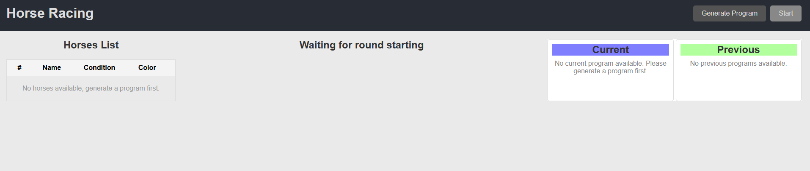
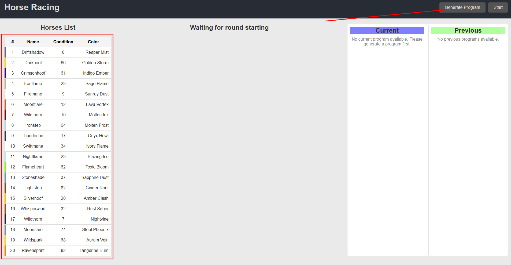
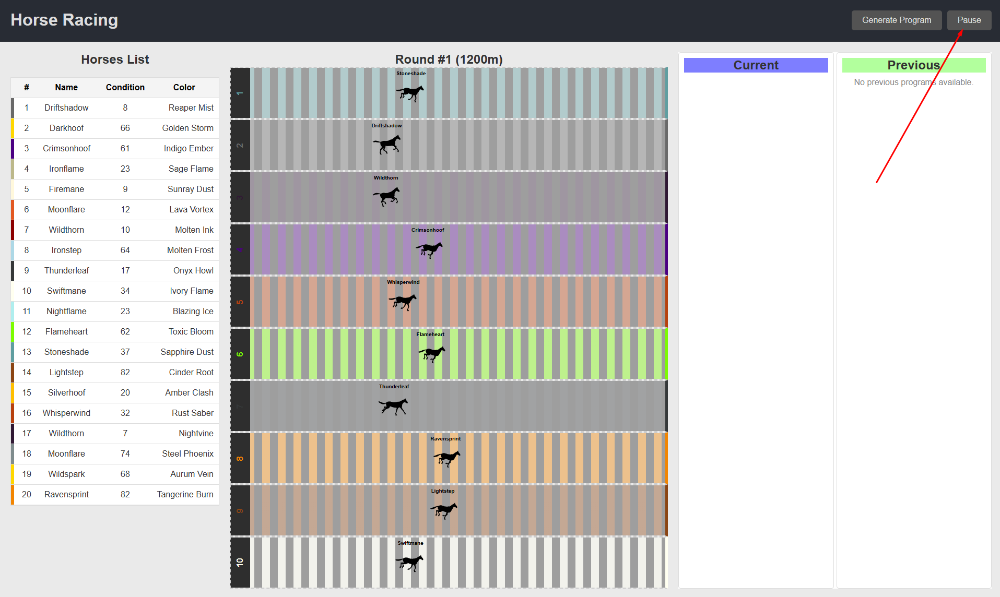
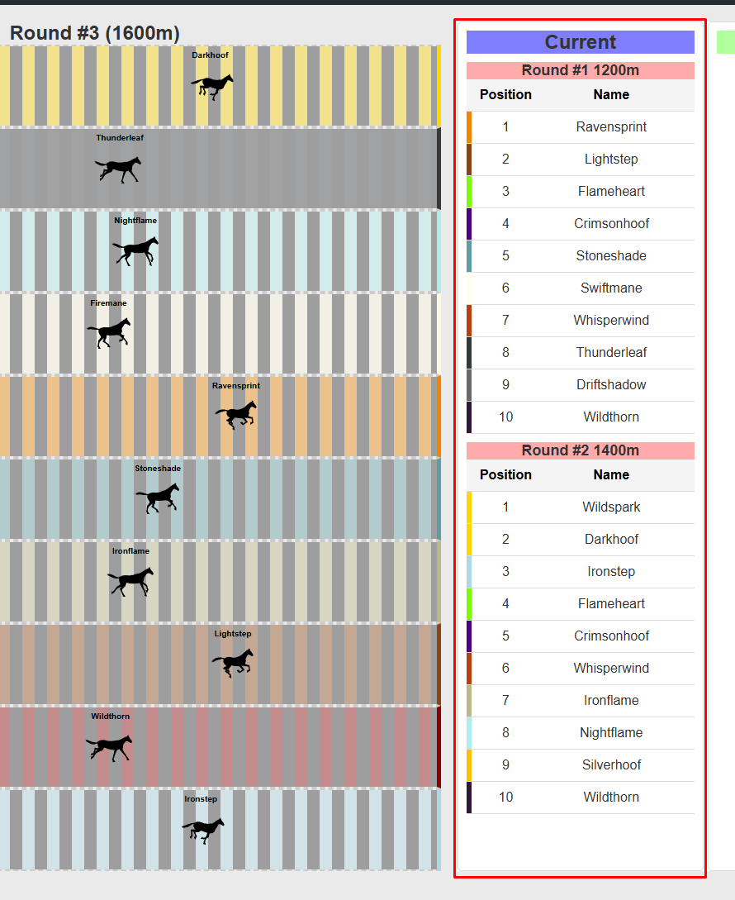
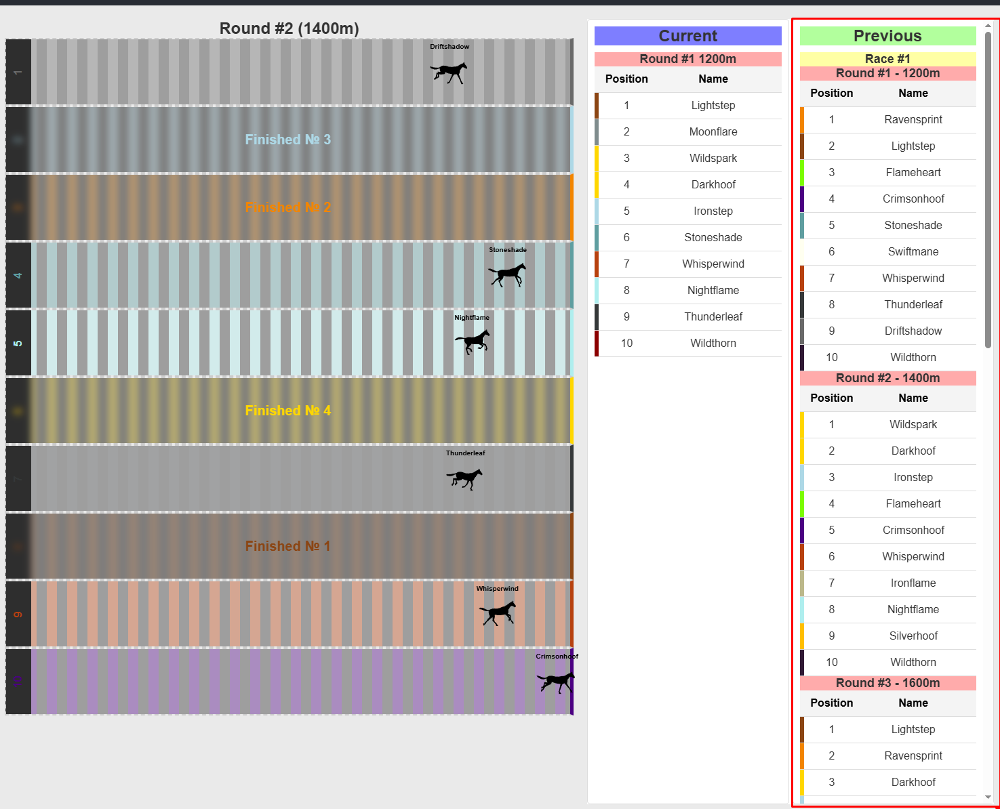

# 🐎 Horse Racing Game

A browser-based simulation of a horse race. Watch randomized horses compete across six intense rounds. Fast-paced, interactive, and fun to develop.

---

## 🎮 How to Play

1. **Launch the game** in your browser.
2. You’ll see the main game interface:

   

3. **Click** `Generate Program` to create a new set of horses with random odds.

   

4. Once horses are generated, **start the race** by pressing `Start`.

   

5. The race runs for **6 rounds**, displaying how far each horse travels per round.
6. You can **pause** the race anytime using the `Pause` button.
7. A detailed **round history** appears in a table below the race view.

   

8. After 6 rounds, the race **ends** and its summary is moved to the `Previous` tab.

   

9. Want a new race? Click `Generate Program` again to roll fresh horses.
10. Want to rerun the race with the same horses? Just click `Start` again.

---

## 🛠️ Project Setup


Install dependencies:
```bash
    yarn
```

Start a development server with hot reload:
```bash
  yarn serve
```

Build for production:
```bash
  yarn build
```

Run unit tests:
```bash
  yarn test:unit
```

Run end-to-end tests (WIP):
```bash
  yarn test:e2e
```

Lint and fix files:
```bash
  yarn lint
```

Format code using Prettier:
* To format the `src` files, you can run:
```bash
  yarn prettier:project
```
* For the tests directory:
```bash
  yarn prettier:tests
```
